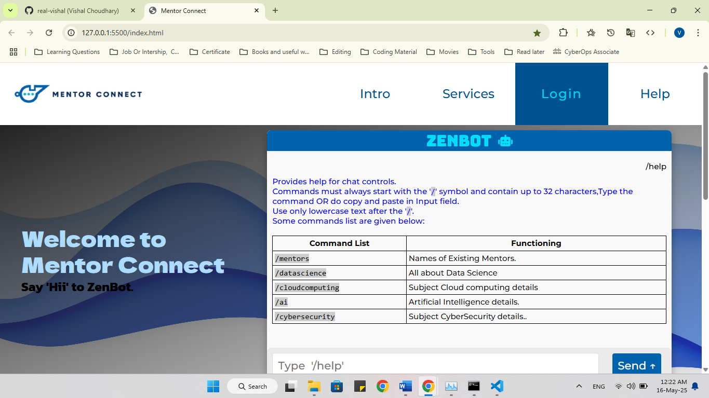
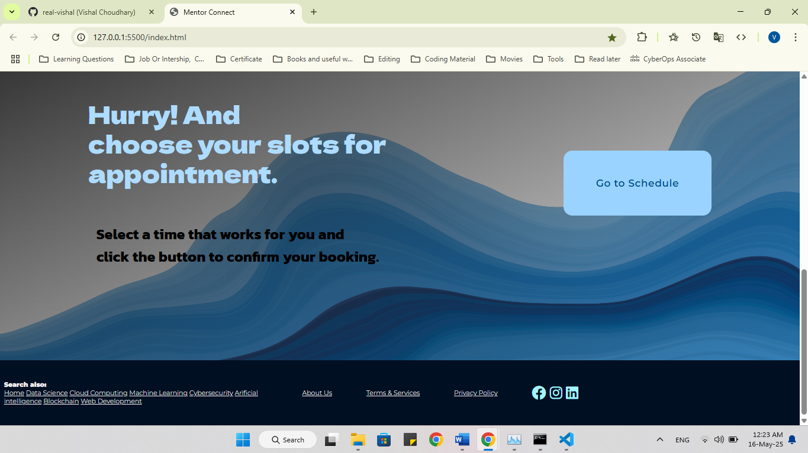
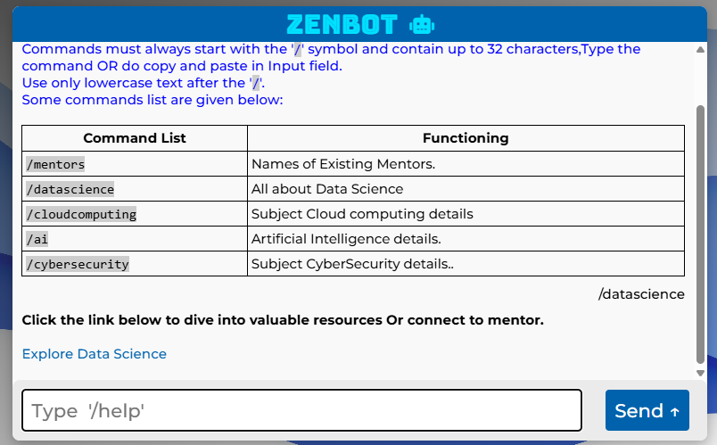

# Mentor Connect 💡

**Created on: 6th September 2024**  
**Team Size: 3 Members**  
**Category: Smart India Hackathon (SIH) Project**  
**Semester: BCA 1st Year, 1st Semester**

---

## 🚀 About the Project

Mentor Connect is a web-based mentorship platform developed as part of our first-year Smart India Hackathon (SIH) entry. Though we were not among the national finalists, our project was honored as the **Best Project on Campus** by the judging panel — a huge milestone for our early academic journey.

---

## 🛠️ Tech Stack

- **Frontend:** HTML, CSS, JavaScript  
- **Backend:** XAMPP (Apache + MySQL)  
- **API Integration:** Calendly for scheduling mentorship sessions  
- **Features:**  
  - Fully responsive UI with a user-friendly experience  
  - Integrated chatbot built using vanilla JavaScript  
  - Automated session reminders via Calendly  
  - Clean, modern design focused on usability and accessibility

---

## 🎯 Highlights

- 📌 **Best Project on Campus** – Recognized by judges for innovation and execution  
- 🤖 JavaScript-based **chatbot** to guide users  
- 📅 **Calendly API** for seamless mentor session bookings  
- 🧠 Focused on **UI/UX Design** to enhance mentor-mentee interaction  
- 🧑‍💻 Built from scratch in the **1st Semester of BCA** — our first official hackathon experience!

---

## 🙌 Acknowledgements

We’d like to thank our mentors, peers, and the entire organizing team of **Smart India Hackathon (SIH)** for the platform and opportunity to learn, build, and showcase our ideas.

---

## 📷 Screenshots

### 🏠 Homepage

### 🤖 Chatbot

---

## 🔗 Project Status

This is a completed prototype submitted for SIH 2024. Future improvements may include mentor rating, chat history, and video session integration.

---

## 👨‍💻 Developed By

- Vishal ([@real-vishal](https://github.com/real-vishal))  
- 🤝Team Members: 2 others (Diwakar Yadav and Chandan Sharma)

---

